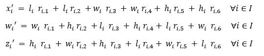
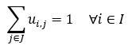
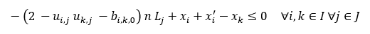
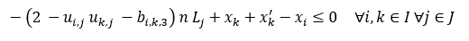
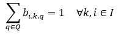

# 3D Bin packing using CQM

Three-dimensional bin packing [Martello et al. 2000](#Materllo) is an 
optimization problem where the goal is to use minimum number of bins to pack items with
different dimensions, weights and properties. Example of bins are containers, 
pallets or aircraft ULDs (Unit Load Device). 
In this example, both items and bins are cuboids, and the sides of items are
parallel to the sides of the bins. There maybe various objectives and 
requirements for a 3d binpacking problem. The most basic requirements are geometric constraints which requires items not
to overlap and also packed within the boundaries of the bins.
There may be additional requirements like stability of the packing and fragility, weight distribution of items and 
flatness of the top or bottom layers.
For this example we only consider dimensions or volume of the boxes and no-overlap requirements.

This example demonstrates a means of formulating and optimizing Three-dimensional multi-bin packing
using a [constrained quadratic model](
https://docs.ocean.dwavesys.com/en/stable/concepts/cqm.html#cqm-sdk) (CQM) that
can be solved using a Leap hybrid CQM solver.

## Usage

To run the demo, type:

    run stramlit bin_packing_app.py

The demo program opens an interface where user can define details of a problem by either importing a file or 
defining the problem through the user interface by adding information for boxes and bins. The user interface also
allows to submit jobs and view the results. 


Alternatively, one can solve an instance of a problem through the user interface by typing:

    python packing3d.py -instance <path to your problem file>

There are several instances under `input` folder. 

This is an example of a 3d bin packing input instance file for 1 bin and 47 cases problem:

```
# Max num of bins : 1
# Bins dimension (L * W * H): 30 30 50

  case id     quantity   length      width    height
  -------     --------   ------      -----    ------
        0           12        5          3         8
        1            9       12         15        12
        2           14        8          5        11
        3            5        9         12         4
        4            7        9         12         4
        
```


Note that:

- there are several number of cases of each size defined by `quantity`

These additional parameters can be passed to `packing3d.py`:

    -h, --help          show this help message and exit
    -instance INSTANCE  path to the input instance file; (default: input/instance5_5.txt)
    -time_limit TL      time limit in seconds (default: None)

The program produces a solution like this:

```
#Number of bins used: 1
#Number of cases packed: 47
#objective value: 154.4145

  case-id    bin-location    orientation    x    y    z    x'    y'    z'
---------  --------------  -------------  ---  ---  ---  ----  ----  ----
        0               1              4    9    0    0     5     8     3
        1               1              3   13   22    0     5     3     8
        2               1              4   16    8    0     5     8     3
        3               1              4    0    9   11     5     8     3
        4               1              1   27    0    0     3     5     8
        5               1              4   16    0    0     5     8     3
```

The number under orientation shows the rotation of the box inside bin as follows.
- 0: if length of box is along `x` axis of the bin , width along `y`, height along `z`  
- 1: if length of box is along `x` axis of the bin , height along `y`, width along `z`
- 2: if width of box is along `x` axis of the bin , length along `y`, height along `z`  
- 3: if width of box is along `x` axis of the bin , height along `y`, length along `z`
- 4: if height of box is along `x` axis of the bin , length along `y`, width along `z`  
- 5: if height of box is along `x` axis of the bin , width along `y`, length along `z`

The following graphic is an illustration of this solution.


## Model and Code Overview

### Problem Parameters

These are the parameters of the problem:

 - `J`: set of bins
 - `n`: number of bins
 - `I`: set of boxes
 - `m` : number of boxes
 - `K` : possible orientations `{0, 1, ..., 6}`
 - `Q` : possible relation between every pair of boxes `{0, 1, ..., 6}`
 - `L_j` : length of bin `j`
 - `W_j` : width of bin `j` 
 - `H_j`: height of the bin `j`
 - `l_i`: height of box `i`
 - `w_i`: width of box `i`
 - `h_i`: Height of the box `i`
 

### Variables
 - `v_j`:  binary variable that shows if bin `j` is used
 - `u_(i,j)`:  binary variable that shows if box `i` is added to bin `j`
 - `s_j`:  optimized height of bin `j`
 - `r_(i,k)`: are binary variables defining `k` orientations for box `i`
 - `x_i`,`y_i`,`z_i`: location of the back lower left corner of box `i` along `x`, `y`, and `z` axis of the bin 

### expressions 
 - `x_i'`,`y'_i`,`z_i`: effective length, width and height of box `i`, considering orientation, along `x`, `y`, and `z` axis of the bin.

### Objective
Our objective contains three terms:
The first term is to minimize the average height of the boxes in a bin which ensures
that boxes are packed down.

   

The second term in the objective ensures that the height of the box at top of the bin is minimized.

   

Our third objective function ensures that total free space in each bin is minimized. 
We squared this term to ensure that the boxes are distributed more evenly between bins.

  

However, this term does not have same unit or magnitude as previous terms. 
Assuming that the unit of height is meter, the first and second objective terms are
in meter, but the third term unit is m^6. 
The contribution of this term to the objective, in meter to the objective is.

  

The total objective value is summation of all these terms. 

### Constraints
#### Orientation constraints
Each box has exactly one orientation:

  

Orientation defines the effective length, width, and height of the boxes along x, w, and z axis.
  


Each box goes to exactly one container  

  

Only assign boxes to bins that are open. 

  

Ensure that bins are added in order, i.e., bin `j` is opened
before bin `j + 1`.

 

#### Geometric constraints
Geometric constraints are applied to prevent overlaps between boxes.
These constraints are only applied when `i`, `j` belong to a bin. 

b_(i,k,0)=1 then box i is behind box k:

 

b_(i,k,1)=1 then box i is on the left of box k:

 

b_(i,k,2)=1 then box i is bellow box k:
 

b_(i,k,3)=1 then box k is behind box i :


b_(i,k,4)=1 then box k is to the left of box i:

 

b_(i,k,5)=1 then box k is to bellow box i:

 

#### Bin boundary constraints:
Ensure that box `i` is not placed beyond the last bin length.
When `u_(i,j)` is `0` this constraint is free.  

 

 

 

 

## References

<a id="Martello"></a>
Martello, Silvano, David Pisinger, and Daniele Vigo. 
"The three-dimensional bin packing problem."
Operations research 48.2 (2000): 256-267.
## License

Released under the Apache License 2.0. See [LICENSE](LICENSE) file.