[](https://ide.dwavesys.io/#https://github.com/dwave-examples/3d-bin-packing) 
[](https://dl.circleci.com/status-badge/redirect/gh/dwave-examples/3d-bin-packing/tree/main)

# 3D Bin Packing

Three-dimensional bin packing [[1]](#Martello) is an 
optimization problem where the goal is to use the minimum number of bins to pack items with
different dimensions, weights and properties. Examples of bins are containers,
pallets or aircraft ULDs (Unit Load Device).
3d binpacking problems may include various objectives and requirements. Basic 
requirements are boundary and geometric constraints, which require that items be 
packed within bin boundaries and without overlapping, respectively. There may be 
additional requirements on the stability of the packing, flatness of top or bottom layers, 
fragility and weight distribution, etc., which are not modeled in this formulation. 
In this example, both items and bins are cuboids, and the sides of the items must be packed parallel 
to the sides of bins. 

This example demonstrates a formulation and optimization of a three-dimensional multi bin packing problem
using a [constrained quadratic model](
https://docs.ocean.dwavesys.com/en/stable/concepts/cqm.html#cqm-sdk) (CQM) that
can be solved using a Leap hybrid CQM solver.

Below is an example output of the program:
<a id="plot"></a>
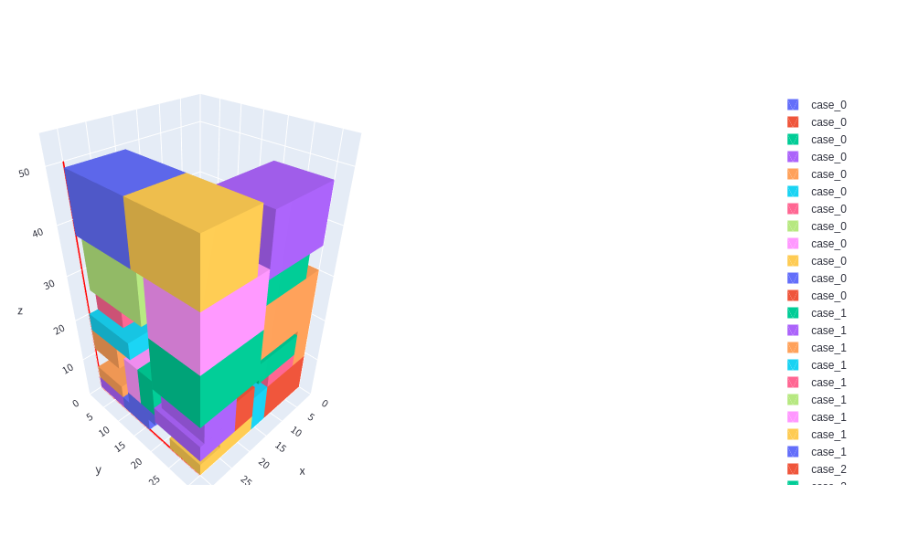

## Installation

This example can be run in the Leap IDE by accessing the following URL:
    
    https://ide.dwavesys.io/#https://github.com/dwave-examples/3d-bin-packing


Alternatively, install requirements locally. Ideally, in a virtual environment.

    pip install -r requirements.txt

## Usage

To run the demo, type:

    streamlit run bin_packing_app.py

The demo program opens an interface where you can instantiate a 3d bin packing problem by either importing a file
or configuring a random problem. The user interface also allows you to submit the problems and view results. 

Alternatively, one can solve an instance of a problem through the terminal by typing:

    python packing3d.py --data_filepath <path to your problem file>

There are several examples of problem instances under the `input` folder. 

### Inputs

This is an example of a 3d bin packing input instance file with 1 bin and 35 cases.

```
# Max num of bins : 1
# Bin dimensions (L * W * H): 30 30 50

  case_id    quantity    length    width    height
---------  ----------  --------  -------  --------
0          12          5         3        8
1          9           12        15       12
2          7           8         5        11
3          7           9         12       4
        
```


Note that:
- all bins are the same size.
- there are several cases of each size (`quantity` sets the number of cases of identity `case id` with all having the dimensions defined in that row).

Run `python packing3d.py --help` in the terminal for a description of the demo program's input parameters.

### Outputs
The program produces a solution like this:

```
# Number of bins used: 1
# Number of cases packed: 35
# Objective value: 104.457

  case_id    bin-location    orientation    x    y    z    x'    y'    z'
---------  --------------  -------------  ---  ---  ---  ----  ----  ----
        0               1              3   15    0    0     3     5     8
        0               1              3    9    0    0     3     5     8
        0               1              6    9   17    0     8     3     5
        0               1              3    0   25    0     3     5     8
        0               1              3   12    0    0     3     5     8
        0               1              2   20    0    0     5     8     3
        ...
```
Note that only a portion of the solution is shown above. Also, there are multiple rows with same `case_id` as 
there are several items of the same size.
The number under the `orientation` column shows the rotation of a case inside a bin as shown in the following figure.

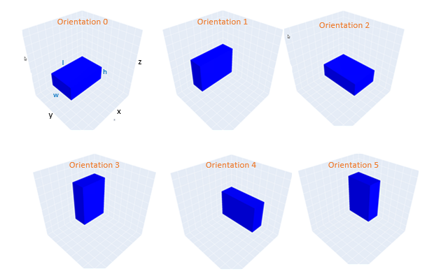  


The [graphic](#plot) at the top of the README is a visualization of this solution.

Note that in this example, we do not model support or load-bearing constraints for cases.
Therefore, it is possible that larger cases are packed over smaller cases without having full support.

## Model Overview

In this example, to model multiple bins we assume that bins are located back-to-back 
next to each other along x-axis of the coordinate system. This way we only need to use one coordinate system
with width of `W`, height of `H` and length of `n * L` to model all bins,(see [below](#problem-parameters)
for definition of these parameters). 
That means that the first bin is located at `0 <= x <= L`, second at `L < x <= 2 * L`,
and last bin is located at `(n - 1) * L < x <= n * L`.  
We apply necessary constraints to ensure that cases are not placed between two bins. 

### Problem Parameters

These are the parameters of the problem:

 - `J`: set of bins
 - `n`: number of bins
 - `I`: set of cases
 - `m` : number of cases
 - `K` : possible orientations `{0, 1, ..., 5}`
 - `Q` : possible relation (e.g., behind, above, etc) between every pair of cases `{0, 1, ..., 5}`
 - `L` : length of the bins
 - `W` : width of bins 
 - `H`: height of the bins
 - `l_i`: length of case `i`
 - `w_i`: width of case `i`
 - `h_i`: height of case `i`
 

### Variables
 - `v_j`:  binary variable that shows if bin `j` is used
 - `u_(i,j)`:  binary variable that shows if case `i` is added to bin `j`
 - `b_(i,k,q)`: binary variable defining geometric relation `q` between cases `i` and `k`
 - `s_j`:  continuous variable showing height of the topmost case in bin `j`
 - `r_(i,k)`: binary variable defining `k` orientations for case `i`
 - `x_i`,`y_i`,`z_i`: continuous variable defining location of the back lower left corner of case `i` along `x`, `y`, and `z` axes of the bin

### Expressions 
 Expressions are linear or quadratic combinations of variables used for easier representations of the models. 
 - `x'_i`,`y'_i`,`z'_i`: effective length, width and height of case `i`, considering orientation, 
 along `x`, `y`, and `z` axes of the bin
 - `o_1`, `o_2`, `o_3`: terms of the objective 

### Objective
Our objective contains three terms:

The first term is to minimize the average height of the cases in a bin which ensures
that cases are packed down.

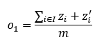

The second term in the objective ensures that the height of the topmost case in each bin is minimized. This 
objective is weakly considered in the first objective term, but here is given more importance.

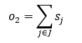

Our third objective function minimizes the total number of the bins.

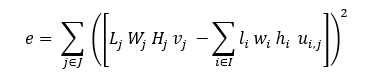

Note that we multiplied this term by the height of the bins so its contribution to the objective has same weights as the
first and second objective terms.
The total objective value is the summation of all these terms. 

### Constraints
#### Orientation Constraints
Each case has exactly one orientation:

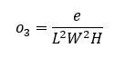

Orientation defines the effective length, width, and height of the cases along `x`, `y`, and `z` axes.

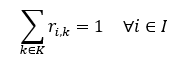

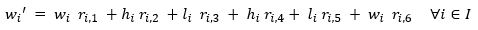


#### Case and Bin Assignment Constraints
Each case goes to exactly one bin.  

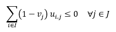

Only assign cases to bins that are in use. 

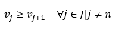

Ensure that bins are added in order; i.e., bin `j` is in use
before bin `j + 1`.

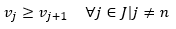

#### Geometric Constraints
Geometric constraints, required only for three-dimensional problems, are applied to prevent overlaps between cases. 
In the following constraints, "left" and "right" refer to the position of the case along the `x` axis of a bin, 
"behind" and "in front of" to the `y` axis, and "above" and "below" to the `z` axis. 
To avoid overlaps between each pair of cases we only need to ensure that at least one of these situations occur:

- case `i` is on the left of case `k` (`q = 0`):

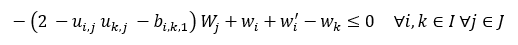

- case `i` is behind case `k` (`q = 1`):

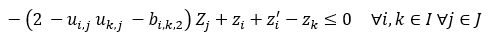 

- case `i` is below case `k` (`q = 2`):


 
- case `i` is on the right of case `k` (`q = 3`):

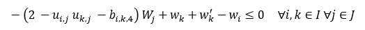

- case `i` is in front of case `k` (`q = 4`):

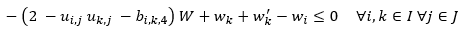
 
- case `i` is above case `k` (`q = 5`):

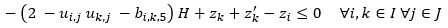

To enforce only one of the above constraints we also need:

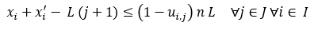

#### Bin Boundary Constraints:
These sets of constraints ensure that case `i` is not placed outside the bins.

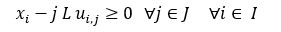


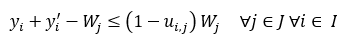

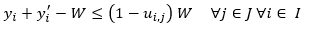

When `u_(i,j)` is `0` these constraints are relaxed.

## References

<a id="Martello"></a>
[1] Martello, Silvano, David Pisinger, and Daniele Vigo. 
"The three-dimensional bin packing problem."
Operations research 48.2 (2000): 256-267.
## License

Released under the Apache License 2.0. See [LICENSE](LICENSE) file.
