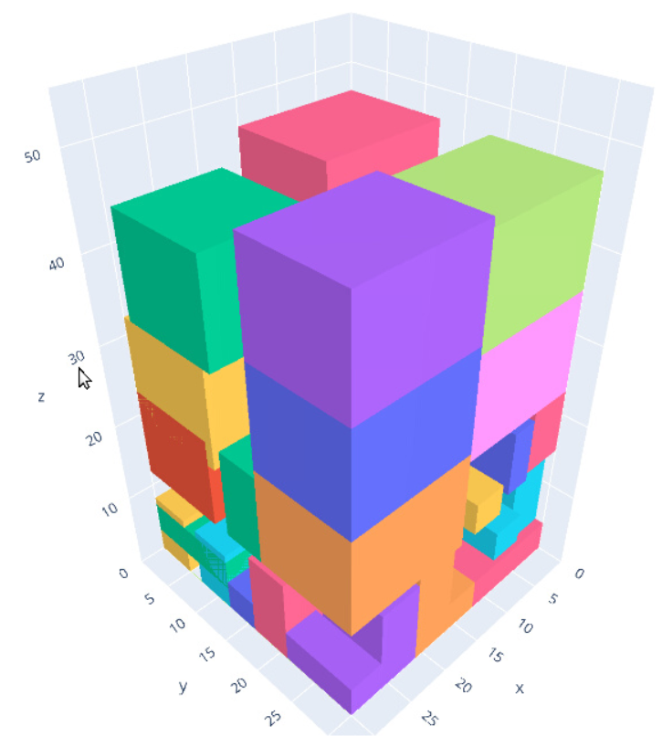

# 3D Bin Packing using CQM

Three-dimensional bin packing [Martello et al. 2000](#Materllo) is an 
optimization problem where the goal is to use minimum number of bins to pack items with
different dimensions, weights and properties. Example of bins are containers,
pallets or aircraft ULDs (Unit Load Device).
In this example, both items and bins are cuboids, and the sides of items are
parallel to the sides of the bins. There maybe various objectives and
requirements for a 3d binpacking problem. 
The most basic requirements are boundary and geometric constraints which require items be
packed within the boundaries of the bins, and without overlap with each another, respectively.
There may be additional requirements like stability of the packing, flatness of the top or bottom layers, 
fragility and weight distribution. 

This example demonstrates a means of formulating and optimizing three-dimensional multi bin packing problem
using a [constrained quadratic model](
https://docs.ocean.dwavesys.com/en/stable/concepts/cqm.html#cqm-sdk) (CQM) that
can be solved using a Leap hybrid CQM solver.

## Usage

To run the demo, type:

    streamlit run bin_packing_app.py

The demo program opens an interface where user can define details of a 3d bin packing problem by either importing a file
or defining the problem through the user interface. The user interface also allows submitting jobs and viewing the results. 

Alternatively, one can solve an instance of a problem through the terminal by typing:

    python packing3d.py ---data_filepath <path to your problem file>

There are several instances under `input` folder. 

This is an example of a 3d bin packing input instance file with 1 bin and 47 cases.

```
# Max num of bins : 1
# Bins dimension (L * W * H): 30 30 50

  case id     quantity   length      width    height
  -------     --------   ------      -----    ------
        0           12        5          3         8
        1            9       12         15        12
        2           14        8          5        11
        3            5        9         12         4
        4            7        9         12         4
        
```


Note that:
- all bins are of the same size
- there are several number of cases of each size defined by `quantity`.

These additional parameters can be passed to `packing3d.py`:

    -h, --help            show this help message and exit
    --data_filepath [DATA_FILEPATH] Filepath to bin-packing data file.
    --output_file [OUTPUT_FILE] Path to the output solution file.
    --time_limit [TIME_LIMIT] Time limit for the hybrid CQM Solver to run in seconds.


The program produces a solution like this:

```
# Number of bins used: 1
# Number of cases packed: 47
# Objective value: 117.266

  case-id    bin-location    orientation    x    y    z    x'    y'    z'
---------  --------------  -------------  ---  ---  ---  ----  ----  ----
        0               1              4    0    0    0     3     8     5
        1               1              1    6    5    0     5     3     8
        2               1              1    0   23    0     5     3     8
        3               1              5    3    0    0     8     5     3
        4               1              3    0   12    0     3     5     8
        5               1              2   11    0    0     5     8     3
        ...
```

The number under orientation shows the rotation of the case inside bin as follows.
- 0: if length of case is along `x` axis of the bin , width along `y`, height along `z`
- 1: if length of case is along `x` axis of the bin , height along `y`, width along `z`
- 2: if width of case is along `x` axis of the bin , length along `y`, height along `z`
- 3: if width of case is along `x` axis of the bin , height along `y`, length along `z`
- 4: if height of case is along `x` axis of the bin , length along `y`, width along `z`
- 5: if height of case is along `x` axis of the bin , width along `y`, length along `z`

The following graphic is an illustration of this solution.



## Model and Code Overview

### Problem Parameters

These are the parameters of the problem:

 - `J`: set of bins
 - `n`: number of bins
 - `I`: set of cases
 - `m` : number of cases
 - `K` : possible orientations `{0, 1, ..., 5}`
 - `Q` : possible relation between every pair of cases `{0, 1, ..., 5}`
 - `L_j` : length of bin `j`
 - `W_j` : width of bin `j` 
 - `H_j`: height of the bin `j`
 - `l_i`: height of case `i`
 - `w_i`: width of case `i`
 - `h_i`: Height of the case `i`
 

### Variables
 - `v_j`:  binary variable that shows if bin `j` is used
 - `u_(i,j)`:  binary variable that shows if case `i` is added to bin `j`
 - `b_(i,k,q)`: binary variable defining geometric relation `q` between box `i` and `k`
 - `s_j`:  optimized height of bin `j`
 - `r_(i,k)`: are binary variables defining `k` orientations for case `i`
 - `x_i`,`y_i`,`z_i`: location of the back lower left corner of case `i` along `x`, `y`, and `z` axis of the bin

### Expressions 
 Expressions are linear or quadratic combinations of variables used for easier representations of the models. 
 - `x'_i`,`y'_i`,`z'_i`: effective length, width and height of case `i`, considering orientation, 
 along `x`, `y`, and `z` axis of the bin
 - `o_1`, `o_2`, `o_3` objective terms
 - `e` squared empty spaces for each bin

### Objective
Our objective contains three terms:

The first term is to minimize the average height of the cases in a bin which ensures
that cases are packed down.


The second term in the objective ensures that the height of the case at top of each bin is minimized. This 
objective is weekly considered in the first objective term, here we give more importance to it. 


Our third objective function ensures that total free space in each bin is minimized. 
We squared this term to ensure that the cases are distributed more evenly between bins.


However, this term does not have same unit or magnitude as previous terms. 
Assuming that the unit of height is meter, the first and second objective terms are
in meter, but the third term unit is square of cubic meter (m^6). 
The contribution of this term to the objective in meter can be obtained using:


The total objective value is summation of all these terms. 

### Constraints
#### Orientation Constraints
Each case has exactly one orientation:


Orientation defines the effective length, width, and height of the cases along `x`, `w`, and `z` axis.


#### Case and Bin Assignment Constraints
Each case goes to exactly one bin.  


Only assign cases to bins that are open. 


Ensure that bins are added in order, i.e., bin `j` is opened
before bin `j + 1`.


#### Geometric Constraints
Geometric constraints are applied to prevent overlaps between cases.
These constraints are only applied when `i`, `j` belong to a bin in a 3d space. Note that in following 
we use "left" and "right" to refer to the position of the case along `x` axis of bin, 
"behind" and "in front of" for `y` axis, and "above" and "bellow" for `z` axis. 
To avoid overlaps between each pair of cases we only need to ensure that at least one of these situations occur:

- case `i` is on the left of case `k` (`q = 0`):


- case `i` is behind case `k` (`q = 1`):

 

- case `i` is bellow case `k` (`q = 2`):


 
- case `i` is on the right of case `k` (`q = 3`):


- case `i` is in front of case `k` (`q = 4`):


 
- case `i` is above case `k` (`q = 5`):


To enforce only one of the above constrains we also need:


#### Bin Boundary Constraints:
These sets of constraints ensure that case `i` is not placed outside the bins.


When `u_(i,j)` is `0` these constraints are free. Note that we assumed that bins are placed next to each other 
along `x` axis. That means any case placed within `0<=x<=L` is in the first bin, if placed withing `L<x<=2*L` it is in the 
second bin and so forth. 

## References

<a id="Martello"></a>
Martello, Silvano, David Pisinger, and Daniele Vigo. 
"The three-dimensional bin packing problem."
Operations research 48.2 (2000): 256-267.
## License

Released under the Apache License 2.0. See [LICENSE](LICENSE) file.